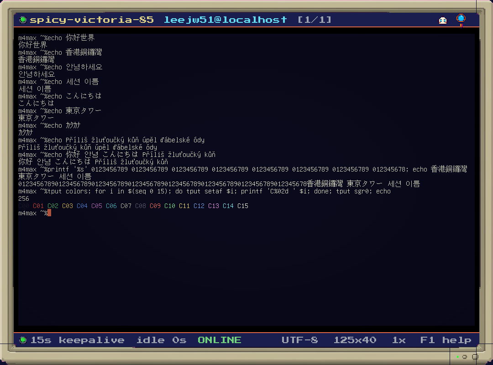

# CAUSEWAYBAY OFFICE

A retro 8-bit terminal SSH client that feels like an MSX2 / Amiga / Genesis
game and is built for real office work. Sessions are cards on a shelf that
pulse with their SSH keepalive; connecting bursts particles and plays a jingle;
the cursor is a rust-coloured block that breathes; a bell shakes the screen;
nothing cuts, every transition fades. Underneath the CRT it is a real
xterm-compatible terminal (`vim`, `top`, `tmux` all work), a Rust SSH core that
keeps up to 128 sessions alive, and an AI sidekick that streams from OpenAI,
Anthropic or xAI using keys sent only to the selected provider. Same universe as
[CAUSEWAYBAY RAIDEN](https://github.com/leejw51/CausewaybayRaiden): the rust coder hero, Wonder Boy
style sprites, the Causeway Bay skyline out the window.



## Quick start

Needs Rust (`cargo` on PATH) and LÖVE 11.5. On macOS the brew cask is
disabled, so LÖVE is expected at `~/Applications/love.app`:

```bash
curl -fsSL -o /tmp/love.zip https://github.com/love2d/love/releases/download/11.5/love-11.5-macos.zip
mkdir -p ~/Applications && unzip -q -o /tmp/love.zip -d ~/Applications
```

Then:

```bash
make core     # cargo build --release -> rust/target/release/libcbo_core.dylib
make start    # launch (builds the core first if needed)
make test     # cargo test + the in-engine suite
```

`make help` lists everything. `make start-mock` launches without the core, for
UI work.

## Keys

| Key | Action |
|---|---|
| F1 | Help |
| Ctrl+N | New session |
| Ctrl+Tab / Ctrl+Shift+Tab | Next / previous session |
| Ctrl+K | Search sessions (fuzzy over name, host, user) |
| Ctrl+Shift+K | Local history; Tab switches to completions and next-command predictions |
| Ctrl+R | Rename session |
| Ctrl+, | Settings (API keys, keepalive, display) |
| Right / Ctrl+Space | Accept the ghost completion after the cursor (Ctrl+Space opens AI when there is none; on macOS it may be taken by the input-source switch, Right always works) |
| Ctrl+Shift+Space | AI sidekick panel (the grid reflows to the remaining width) |
| Ctrl+= / Ctrl+- | Terminal zoom 1x / 2x (also in Settings) |
| Shift+PgUp / PgDn, wheel | Scrollback |
| F11 | Fullscreen |
| Esc | Raw ESC to the shell (vim-safe); closes a panel or overlay |
| F2 / Ctrl+Esc / Esc Esc | Back to the lobby (Esc double-tap within 300 ms); also the "◀ LOBBY" button in the top bar |
| Right-click / wheel on top bar | Context menu: lobby, map, rename, close session, help |
| M | World map (from the lobby); Esc / M / F2 returns. Arrows/WASD move along the paths, Enter walks the hero there and connects, R rename, Del forget host, [ ] page |
| G / MAP2 button | Session grid: search by name/address; filter All, Online, Connecting, Offline, Error or Favorites |
| F11 / Settings > display | Fullscreen (desktop) or window, remembered in SQLite and logged to display.jsonl |
| Ctrl+O / Settings > orientation | auto / landscape / portrait layout (portrait: 1-2 card columns, AI panel below the terminal, the same horizontal map fitted to the width) |

When a terminal has focus everything else (Ctrl+C, Ctrl+D, arrows, function
keys) goes straight to the remote shell.

The grid is drawn at the font's native size (Unifont, 8x16 px per cell), so a
1080x800 window with the bezel on gives 125x40 cells and 1920x1080 gives
225x53; the chrome around it keeps its chunky integer pixel scale.

## Unicode

UTF-8 in, code points out. Chinese, Korean and Japanese render as proper
double-width cells (`你好世界`, `안녕하세요`, `こんにちは`), Czech and other Latin
diacritics as single-width (`Příliš žluťoučký kůň úpěl ďábelské ódy`), and
combining marks occupy no additional cell. The current single-code-point cell ABI does not render combining accents; precomposed letters render normally. Press Start 2P draws the ASCII
range; anything it lacks falls back to GNU Unifont, which covers the whole
Basic Multilingual Plane, so nothing renders as a tofu box.

## Images in the terminal (kitty graphics protocol)

The terminal speaks the [kitty graphics protocol](https://sw.kovidgoyal.net/kitty/graphics-protocol/),
so `kitten icat picture.png`, `chafa -f kitty`, `timg -pk`, image previews in
`yazi`/`ranger` and anything else that emits `ESC _ G ... ESC \` shows real
pictures between the lines of text. Supported: PNG and raw RGB/RGBA payloads,
zlib compression, chunked transfers, image ids and numbers, placements with
`c`/`r` cell sizes and source rectangles, z-index (negative draws under the
text), `C=1` cursor control, delete commands and the capability query. Only
direct transmission is supported; file/shared-memory media are refused with an
error so clients fall back to streaming over the SSH channel. Images scroll
with the text, come back when you scroll up, and go away with `clear`.
The pty reports pixel sizes (`TIOCGWINSZ`, `CSI 14 t`, `CSI 16 t`) so clients
size pictures to the 8x16 cell grid.

Try it with the bundled tool from inside a session:

```
python3 tools/kitty_test.py            # a test picture
python3 tools/kitty_test.py --all      # every payload variant
python3 tools/kitty_test.py --query    # is the protocol available here?
python3 tools/kitty_test.py photo.png  # your own PNG
```

The same script self-tests the core through the C ABI over localhost SSH
(`python3 tools/kitty_test.py --selftest`, part of `make test`).

## Sessions

* Supports **100 simultaneous sessions**, within the core's 128-slot capacity.
* New sessions get simple unique names such as `mary-1`, `john-2` and `emma-3`.
  Rename with Ctrl+R (any UTF-8, up to 32 characters); custom names persist.
* Ctrl+K searches fuzzily over name, host and user. Ctrl+Shift+K opens local history and command assistance from a terminal.
* Keepalive: the core sends an SSH keepalive every 15 s (configurable per
  session, 0 = off), and the session card pulses each time one goes out. An
  idle session stays up for hours.
* Auth: ssh-agent first, then `~/.ssh/id_*`, then a password if you gave one.
* Favorites persist in `~/.causewaybayoffice/favorites.jsonl`. Successfully connected
  sessions and their names persist separately in `sessions.jsonl` and automatically
  reconnect on the next launch. Duplicate server addresses remain separate sessions.
  Explicitly closing a session removes it from restoration. Passwords are not saved;
  reconnect uses keys/agent and reports errors when credentials are unavailable.

## AI sidekick

Click **AI CHAT**, or use Ctrl+Shift+Space, to open chat. In vertical mode it stacks
below the terminal at full width; in horizontal mode it docks beside the terminal.
Enter or **SEND** submits a prompt; **KEY** opens settings when credentials are
missing. Chat input, including clipboard paste, never passes through to SSH.
Ask a question, get a streamed
answer. Three providers, all client-side — the key goes from your disk to the
provider's API and nowhere else:

| provider | default model | env var |
|---|---|---|
| openai | gpt-5 | `OPENAI_API_KEY` |
| anthropic | claude-opus-5 | `ANTHROPIC_API_KEY` |
| xai | grok-4.6 | `XAI_API_KEY` (or `GROK_API_KEY`) |

Keys are entered in Settings (Ctrl+,) and saved in the private local SQLite database; an environment variable is used when the settings field is
empty.

## Two maps and automatic Favorites

* **Map**: the Mario-style world map. Click an empty stage (or select it and press
  Enter) to open the connection form. The new server stays on that stage.
* **Map2**: a grid of live sessions and saved servers. Type in the search box,
  select a connection-state filter or Favorites, and click a card to open it.
  Tab cycles filters; arrows select cards; the wheel scrolls the grid.
  A moving selection frame follows the chosen card. Right-click a live card, or
  press Delete, to choose **Disconnect**.
* Every server you connect to is automatically saved as a **Favorite**, deduplicated
  by user, host and port. Favorites persist across restarts and are not evicted
  when more servers are added. They also appear in the connection form.
* Use the MAP/MAP2 buttons to switch views. In the lobby, **M** opens Map and **G**
  opens Map2. Empty maps contain connection slots, not fabricated servers.

Opening a session from either map eases the camera toward it with exponential
zoom. Returning pulls back onto the same session. Explicit disconnects use a
black, pixel-stepped circular aperture: close, change the scene, then open.
Favorites remain saved, and disconnect intent is persisted before the animation
finishes. Display toggles remain available throughout.

Old QA-only `mock-NN.lan` entries are removed from the normal favorites file at
startup, with the original list backed up in SQLite (`ui.hosts.before-fixture-cleanup`). Test/screenshot and
mock runs now use separate save directories to prevent this happening again.

Two display toggle buttons stay above every page and dialog: the first switches
window/fullscreen; the second switches vertical/horizontal. Their labels show the
current mode. Portrait Map uses a tall route with compact details. Drag the background
(or right/middle-drag anywhere), use the wheel or Shift+Arrow keys to pan. Home
recenters the selected stage; arrows select stages and [ ] change pages. Each live session
has its own stage, including multiple sessions connected to the same favorite.

## Remembered input and storage

Non-secret editboxes restore drafts and search previous entries as you type.
**Ctrl+Space** accepts the suggested entry; **Ctrl/Cmd+A** selects the whole field
for quick replacement. This covers connection details, searches, names, model
settings and AI prompts. Current names/settings stay visible when editing them.
Passwords and API keys are excluded from learned input. Field history stays local,
separate from optional terminal recording and OpenAI indexing.

The remote working directory is remembered per session and per host. Bash,
zsh and fish receive session-only OSC 7 prompt integration, including custom
prompts; your startup files are not edited. The next connection returns to the
saved directory after the first prompt. Starting to type cancels automatic `cd`.
Other shells can report OSC 7 or a `user@host: ~/dir` title. Missing directories
produce the shell's normal error.

The terminal shows the current folder beneath the toolbar, updating as you change
directories. Click the path or COPY to copy the full folder path.

### Upload and download

Use **UPLOAD** / **DOWNLOAD** in the terminal toolbar, or **Ctrl+Shift+U** /
**Ctrl+Shift+D**. Upload opens the Mac file chooser; dropping a file onto the terminal
also works. The remote destination uses the shell's current directory and the
original filename automatically.

**Click DOWNLOAD, then click a filename in the terminal output** to download it.
The button stays highlighted while picking; hover underlines the filename. Esc or
clicking DOWNLOAD again cancels. Ctrl+Shift+D enables the same picking mode.
You can also Cmd/Ctrl-click a filename, or right-click it and choose Download. The app parses quoted/escaped filenames and compiler `file:line:column`
references, resolves relative paths against the shell's reported directory, and
fills in `~/Downloads/<filename>`. For unquoted names containing spaces, select the
whole name first. Detected files transfer immediately, with progress in the terminal status bar
and no extra confirmation. Click that status to cancel, inspect the destination,
retry with a different filename, or show a completed download in Finder. Right-click
and choose Recent transfer to reopen the details later. If a path cannot be inferred,
a compact sheet lets you enter it. Downloads use SFTP directly; no shell copy
commands are inserted. The shell directory applies to relative names from the current
folder; older output or listings of another folder may need an absolute path.

The optional **Ctrl+Shift+F** browser provides local and remote file lists. They sit side by side in wide windows and stack in portrait. Double-click
a folder or press Enter to open it; edit a path and press Enter/GO to jump there.
**SHELL DIR** opens the terminal's current remote directory. **SHOW DOTS** toggles
hidden files; Tab switches lists, arrows select, and the wheel scrolls.

Select a local file and click **UPLOAD**, or select a remote file and click
**DOWNLOAD**. Review the editable destination filename, then start. Progress and Cancel are shown while transferring;
you can close Files and continue typing, then reopen it to see the result.
Existing destination files are kept: choose a different filename for another copy.
Incomplete files are removed after a failed or cancelled transfer when possible.

Transfers use SFTP on a separate SSH connection with the terminal's credentials
and host-key checks. The server must support SFTP. This version transfers individual
regular files; folders can be browsed but are not copied recursively.

Under `~/.causewaybayoffice/` (or `CBO_HOME`):

* `office.db`: settings, field drafts/history, favorites cache and optional recordings.
* `favorites.jsonl`: current favorites, one JSON server object per line; updated
  automatically and loaded on startup. Passwords are never included.
* `sessions.jsonl`: sessions to reconnect, including their names, addresses, key paths
  and stage positions; one JSON object per line.
* `display.jsonl`: append-only mode changes with timestamp, fullscreen, orientation
  and horizontal flag. SQLite restores the selected mode on startup.

Existing LÖVE `config.json` and `hosts.json` are imported when the new stores are
absent; real app saves use the new stores. Demo and QA data stay isolated.

## Recording, history and privacy

Command-only learning stores visibly echoed, simple prompt commands and their
sequences in SQLite. Suggestions update while typing and show as dimmed ghost text
after the cursor; Right arrow, Ctrl+Space or clicking the suggestion fills only the
missing suffix, without Enter. Readiness comes from the echo (your typed text visible on
the cursor line), so emoji or word prompts work as well as `$`/`%`. Native shell Tab completion
still works. Hidden input, ambiguous editing and alternate-screen programs are
excluded from this learning. Commands can contain sensitive arguments; the local
database is unencrypted.

Recording is **off by default**. Enable “record terminal” in Settings to store
terminal input/output and learn command history in `~/.causewaybayoffice/office.db`
(`CBO_HOME` overrides the directory). Turning it off also stops existing sessions.
Recordings can contain passwords typed into remote programs and other secrets;
they are not encrypted. Disable recording before entering sensitive input.

Ctrl+Shift+K opens local history in a terminal. Tab switches between text search,
command completion and next-command predictions. Enter reviews a command before
sending it, or copies a non-command result. Command reconstruction is approximate:
shell editing, history navigation and full-screen programs can make it inaccurate.

“OpenAI indexing” is a separate, default-off setting. Enabling it permits background
uploads of stored commands, transcripts, AI records and saved-host details to OpenAI
for embeddings, using your key. This can incur API charges. The history UI uses local
text search; semantic/hybrid search is also exposed through the core ABI.

Ctrl+Enter in the AI panel now opens a command review. Clipboard paste uses the
remote terminal’s bracketed-paste mode when available; multiline paste otherwise
opens a review. Pasted control escapes are removed. Sending input containing
newlines can execute commands, so check the review before accepting it.

Favorites are saved atomically; display journal writes are locked. SQLite and JSONL
files use a private data directory and file permissions; this is not encryption or
Keychain storage. SSH uses trust on first use and rejects changed saved host keys.
See [repair and security review](docs/REPAIR_REPORT.md) for checks and limitations.

## Architecture

```
 ┌───────────────────────────────────────────────────────────────┐
 │ LÖVE 11.5 (love2d/)                                            │
 │  scenes: boot -> lobby -> terminal   overlays: connect/search/ │
 │  rename/settings/ai      fx: tweens, particles, CRT canvas     │
 │  term_view.lua draws the CboCell grid   ai.lua drives cbo_llm_*│
 │                        │ polls every frame (love.update)       │
 │                        ▼                                       │
 │  src/core.lua ── LuaJIT FFI ── src/cbo_cdef.lua (mirror of     │
 │                                 rust/include/cbo.h)            │
 └────────────────────────────┬──────────────────────────────────┘
                              │ C ABI: ints, structs, UTF-8 strings
 ┌────────────────────────────▼──────────────────────────────────┐
 │ libcbo_core.dylib (rust/, crate cbo_core)                      │
 │  lib.rs      FFI surface only                                  │
 │  session.rs  registry (128 slots), state machine, keepalive    │
 │  ssh.rs      ssh2 transport, auth, pty, one thread per session │
 │  term.rs     vt100 emulation -> CboCell snapshot               │
 │  graphics.rs kitty graphics: images, placements, replies       │
 │  llm.rs      SSE streaming: openai / anthropic / xai           │
 │  names.rs    neon-tram-07     search.rs  fuzzy session search  │
 └───────────────────────────────────────────────────────────────┘
```

Rust owns transport, emulation, keepalive, LLM streaming, the registry, SQLite,
JSONL storage, command learning and search. Lua owns UI, input, session naming and
game feel, and calls Rust persistence APIs. The core never calls back into Lua; Lua polls state, generation
counters and text deltas from `love.update`. Strings returned by the core live
in a per-call thread-local buffer: copy with `ffi.string` before the next call.

## Development

See [testing and verification](docs/TESTING.md) for prerequisites, coverage, reports,
and how missing provider credentials are reported.

```
Makefile              build, run, test, package
VERSION               the version of record (one line)
docs/SPEC.md          the contract; read it first
docs/ROADMAP.md       what comes after v0.1.0
docs/QA_CHECKLIST.md  the manual acceptance script
rust/include/cbo.h    C ABI — source of truth for the FFI boundary
rust/src/             the core
love2d/               the app (main.lua, conf.lua, src/, assets/)
love2d/src/cbo_cdef.lua  generated from cbo.h by `make cdef` — do not hand-edit the cdef block
python/gen_art.py     sprite/background generator (xAI grok-imagine-image, GROK_API_KEY)
tools/kitty_test.py   kitty graphics protocol: show test images, probe, self-test the core
```

| target | what it does |
|---|---|
| `make core` / `core-debug` | build the dylib (release / debug) |
| `make cdef` | regenerate the Lua cdef mirror from `cbo.h` |
| `make start` / `start-mock` | run the app (with / without building the core); `ARGS=` passes through |
| `make test` | all unit/integration/FFI/UI/restart checks, with logs and a JSON report |
| `make test-unit` | Rust library unit tests and the LÖVE regression suite |
| `make lint` | byte-compile every Lua file + `cargo clippy` |
| `make format` / `fmt-check` | stylua + cargo fmt |
| `make check` | formatting + lint + tests |
| `make test-integration` | all Rust integration targets, FFI and real SSH UI/restart checks |
| `make test-live` | explicit provider/embedding API checks (may incur charges) |
| `make smoke` | `cargo run --release --example smoke` |
| `make art` | regenerate assets |
| `make love` / `make app` | `.love` archive / unsigned macOS `.app` with LÖVE and the dylib inside |
| `make clean` | remove build output |

Change `cbo.h` and `cbo_cdef.lua` together (via `make cdef`) or not at all.

## Credits

* [CAUSEWAYBAY RAIDEN](https://github.com/leejw51/CausewaybayRaiden) — same universe, same hero, same
  Causeway Bay; the CRT, display and fx code follow its style.
* [GNU Unifont](https://unifoundry.com/unifont/) — dual-licensed
  [SIL OFL 1.1](love2d/assets/fonts/LICENSE-unifont.txt) or GPL 2+ with the
  font embedding exception; used here under the OFL.
* [Press Start 2P](https://fonts.google.com/specimen/Press+Start+2P) by
  CodeMan38 — [SIL OFL 1.1](love2d/assets/fonts/LICENSE-pressstart2p.txt).
* [LÖVE](https://love2d.org) 11.5, LuaJIT, and the `ssh2`, `vt100`, `ureq`
  and `unicode-width` crates.
